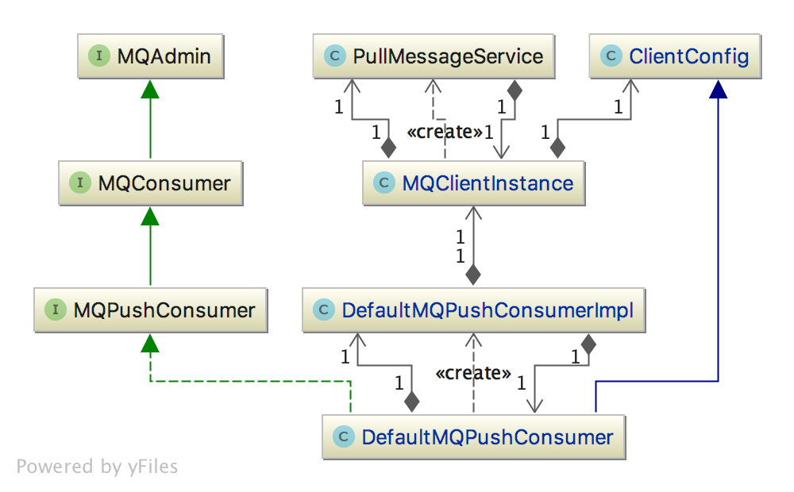
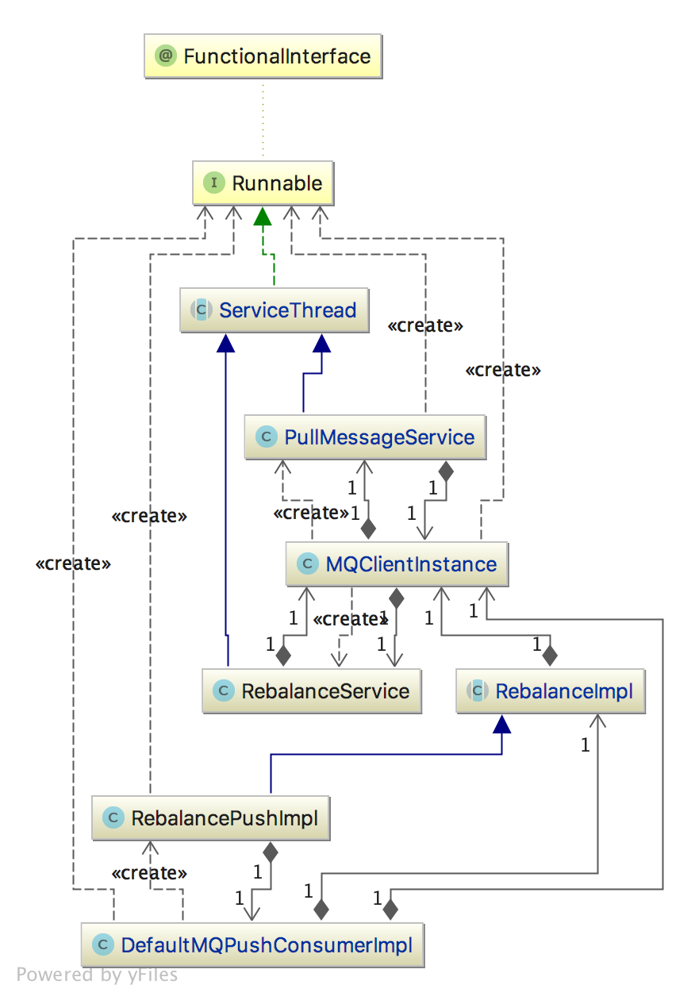
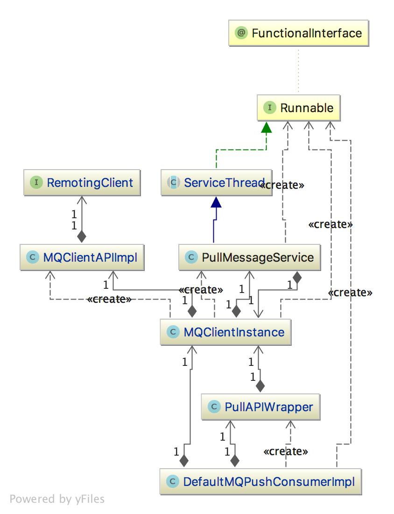
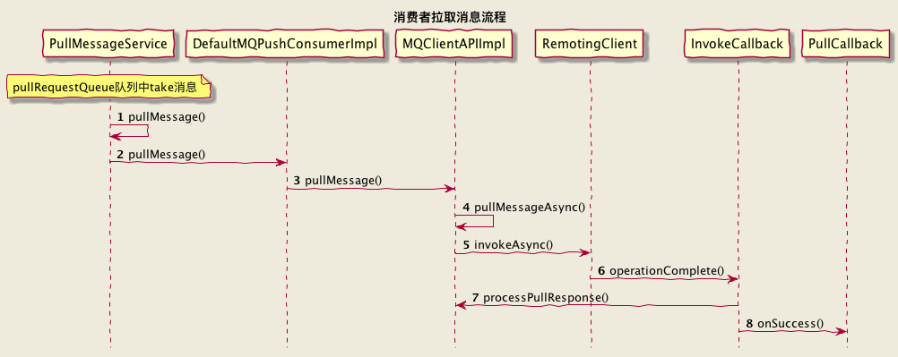

# 1.Consumer 消费消息基本流程

RocketMQ 分别使用 DefaultMQPullConsumer 和 DefaultMQPushConsumer 实现了拉取和推送两种方式

* Consumer启动

类图


启动过程中 PullMessageService被初始化，执行以下方法

```Bash
public void run() {
        log.info(this.getServiceName() + " service started");

        while (!this.isStopped()) {
            try {
                // 阻塞获取 pullRequestQueue pull 请求
                PullRequest pullRequest = this.pullRequestQueue.take();
                if (pullRequest != null) {
                    // 拉取消息
                    this.pullMessage(pullRequest);
                }
            } catch (InterruptedException e) {
            } catch (Exception e) {
                log.error("Pull Message Service Run Method exception", e);
            }
        }

        log.info(this.getServiceName() + " service end");
    }
```

pullRequestQueue 数据如何来的？

类图


* Consumer拉取消息

类图


流程图


如何保证消费成功？
PullConsumer模式，需要使用方自己实现
PushConsumer有ack机制
