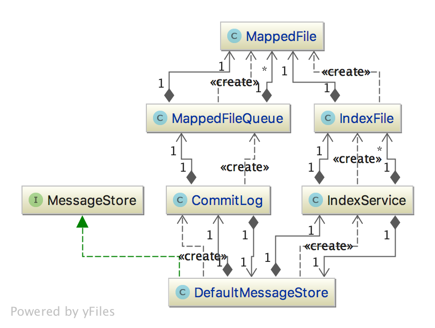
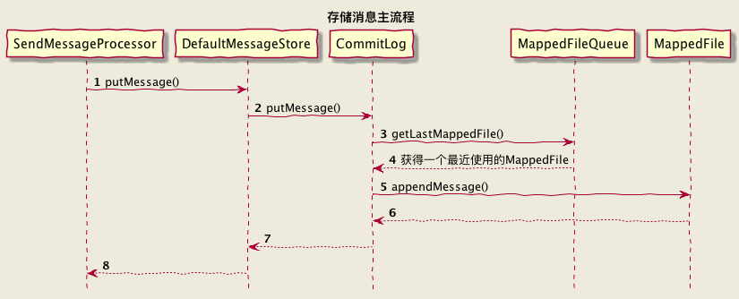

## 1 消息存储类图

各个关键对象的作用：

**DefaultMessageStore**这是存储模块里面最重要的一个类，包含了很多对存储文件的操作API，其他模块对消息实体的操作都是通过DefaultMessageStore进行操作。 
**commitLog** commitLog是所有物理消息实体的存放文件，这篇文章的架构图里可以看得到。其中commitLog持有了MapedFileQueue。 
**consumeQueue:**consumeQueue就对应了相对的每个topic下的一个逻辑队列（rocketMQ中叫queque，kafka的概念里叫partition）, 它是一个逻辑队列！存储了消息在commitLog中的offSet。 
**indexFile**存储具体消息索引的文件，以一个类似hash桶的数据结构进行索引维护。 
**MapedFileQueue**这个对象包含一个MapedFileList,维护了多个mapedFile，升序存储。一个MapedFileQueue针对的就是一个目录下的所有二进制存储文件。理论上无线增长，定期删除过期文件。

## 2 存储消息
### 2.1 CommitLog消息存储流程

### 2.2 刷盘策略

* 异步落盘

GroupCommitService

* 同步落盘

FlushRealTimeService

### 2.3 消息索引

IndexService